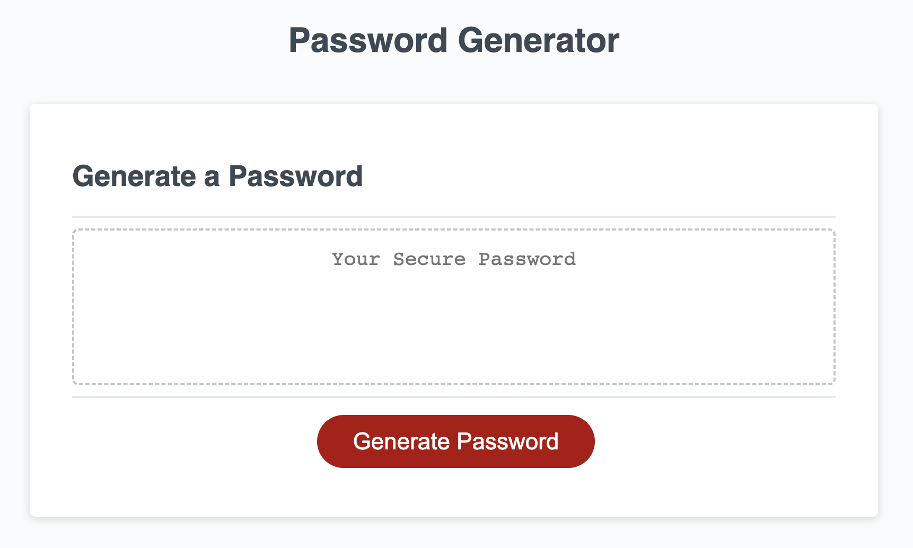
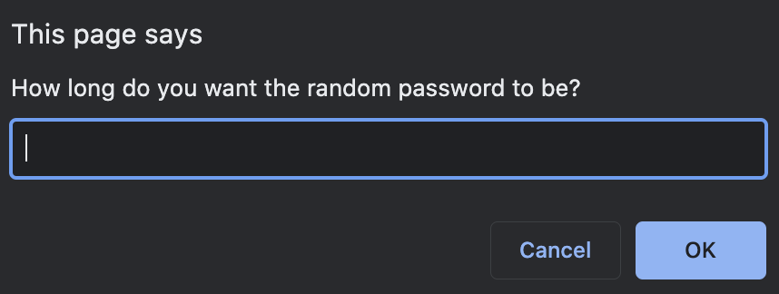

# Password Generator

## Description

The password generator allows the user to generate a random password based on a number of user inputs. The inputs the user is able to choose between are password length, whether on not to include special characters, whether to include numbers, whether to include upper case letters and whether to include lower case letters. After all of the inputs have been defined, the randomly generated password will appear in the box on the screen. 

Link to application: https://mjonas14.github.io/friendly-parakeet/

## Usage

The user begins by clicking the "Generate Password" button on the screen. They will then be prompted by pop-up windows that will appear at the top of the screen asking the user to define the parameters. For password length, the user must pcik a number between 8 and 128, and for the remainder of the questions, the user must only write "y" for yes and "n" for no. If any of these parameters aren't met, an alert will appear detailing what error the user had, and they will be prompted again with the same question. If the user hasn't defined any parameters beyond the password length, an alert will appear detailing that the user must define at least one character type for their password, and thereafter will have to go through the parameter definition prompts again. Once all of the parameters have been defined, the randomly generated password will appear in the box on the screen, and from there it can easily be copied and pasted to wherever the user may need it. 

Screenshot of the webpage: 

Screenshot of an example of the prompts: 

Screenshot of example of password generated: 

## Credits

Thank you to UCB Coding Bootcamp course materials for providing the html and css code used for this application. 

## License

N/A
